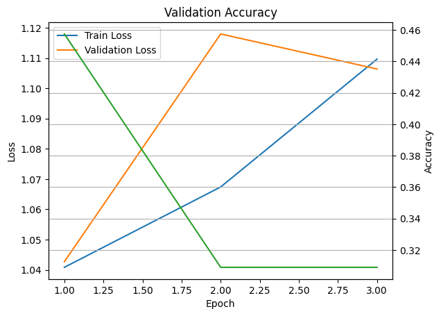

# QLoRA Fine-Tuning:

This project demonstrates an advanced, highly efficient methodology for fine-tuning a pre-trained Transformer encoder (e.g., **DeBERTa-v3-small**) to solve a comparative ranking task. It trains a model to predict the winner between two competing language model responses (**Model A vs. Model B**) based on human preference data (e.g., the **LMSys Chatbot Arena** dataset).

The entire pipeline is optimized for memory and speed using **QLoRA** and is structured for robust training on **L40S GPU** using **PyTorch**.

---

## 🌟 The Core Technology: QLoRA Explained

### 1️⃣ Q (Quantization): 4-bit Base Model

The project loads the large pre-trained model in **4-bit precision (NF4 data type)** — crucial for memory efficiency.

* **Benefit:** Drastically reduces memory footprint (e.g., from 16 GB → 4 GB).
* **Methodology:** QLoRA uses **NormalFloat4 (NF4)** and **Double Quantization** to shrink model size without significantly sacrificing performance.

### 2️⃣ LoRA (Low-Rank Adaptation): Trainable Adapters

LoRA makes fine-tuning feasible by drastically reducing the number of trainable parameters. It introduces a small, parallel pathway for weight updates inside the massive Transformer layers, allowing the model to learn new tasks with minimal overhead.

Instead of training all weights ($W_0$), LoRA introduces a smaller update path ($\Delta W$):

$$
h = W_0 \cdot x \quad \rightarrow \quad h = (W_0 + BA) \cdot x
$$

* $W_0$: Large, original, **frozen** weight matrix.
* $A, B$: Small, **trainable** matrices ($A$ and $B$) that form the low-rank adapter.

| Metric | Value |
| :--- | :--- |
| Trainable Params | $663,552$ |
| All Params | $141,967,872$ |
| **Trainable %** | **$0.4674\%$** |

**Checkpoint Size:** Only the tiny adapter matrices are saved — measured in **MB**, not **GB**, 2.5MB in our case.

---

## 🧠 Model Architecture: Siamese Ranking (Bi-Encoder)

A custom **Siamese network** is designed for comparing two inputs, ensuring both are processed by the same encoder instance.

### Architecture Diagram (Compact ASCII)

```text
       ┌───────────────────────────────────────────────────────────┐
       │             QLoRA-Tuned Transformer Encoder             │
       │           (W_0 is frozen, A/B adapters are trained)       │
       └───────────────────────────────────────────────────────────┘
               ▲          ▲          ▲             │
               │          │          │             ▼
Input A: P + Res A ─► Tokenize ─► Model ─► Avg Pool ─┐
                                                     │
                                                     ├─► CONCATENATE ─► Linear (3 Classes)
                                                     │
Input B: P + Res B ─► Tokenize ─► Model ─► Avg Pool ─┘
```



